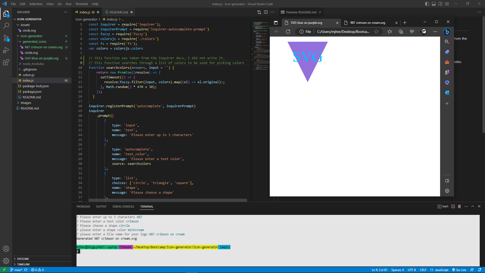

# Icon-generator
the challenge this week was to create a command line program that will generate an svg using prompts from the inquirer module

## requirments
this project was supposed to be run in the command line. the user is given prompts asking for text, text color, shape, and shape color.

using this input the program is supposed to create svg code creating a logo

## screen shots

## github
[github repository](https://github.com/shyguyMatt/Icon-generator)

## video link
[example video](https://youtu.be/_KBbkhilDtY)

